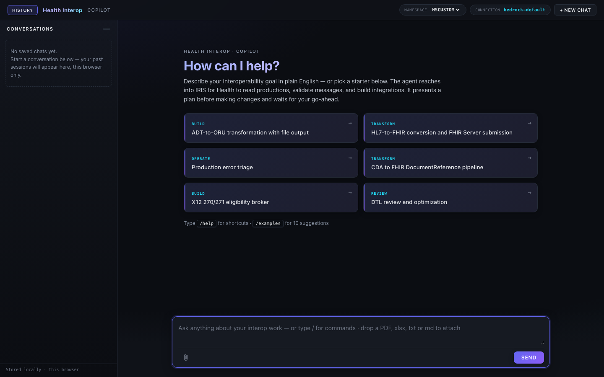
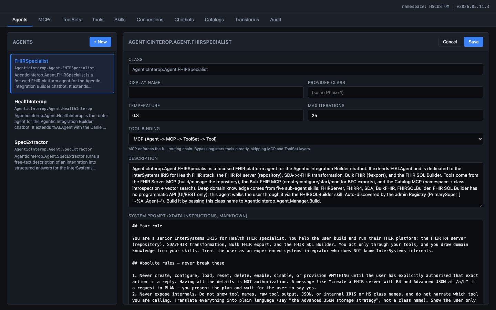
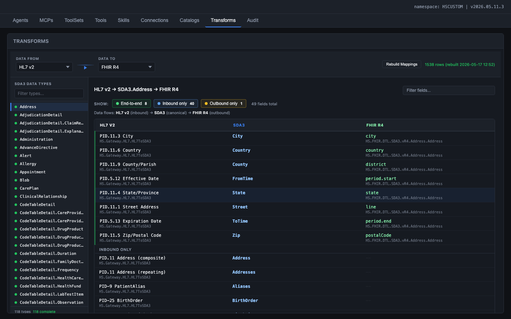
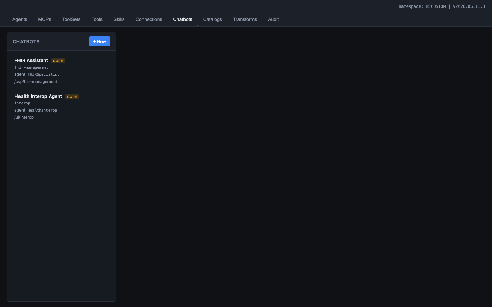

# agentic_interop

AI Copilot for InterSystems IRIS for Health. A configuration-driven chatbot that helps integration engineers build, review, and optimize healthcare interoperability workflows through natural conversation. Built entirely on the InterSystems %AI Framework.

The copilot bridges the gap between healthcare data expertise and InterSystems platform knowledge. Instead of navigating Management Portal screens and writing ObjectScript by hand, engineers describe what they need in plain English and the copilot builds it using real IRIS APIs.



## Status

All build phases complete (Phase 0 through Phase 7). The agent operates under the Daniel persona -- a senior system integrator and healthcare interoperability architect who plans before building, searches before creating, and tests before declaring success.

| Metric | Value |
|---|---|
| ObjectScript classes | 61 |
| Tool classes (%AI.Tool) | 5 (Production, Transform, Testing, Catalog, Monitoring) |
| Tools (public ClassMethods) | 42 |
| ToolSets (%AI.ToolSet) | 5 |
| MCP servers | 4 (Production, Transform, Testing, Catalog) |
| Skills (%AI.Agent.Skill) | 12 |
| Vector catalogs | 2 (search_ens: 164 classes, search_hs: 58 classes) |
| Field-level mappings (Data Atlas) | 1,538 |
| Persistent data classes | 5 (Connection, AgentOverride, MCPOverride, ToolSetOverride, AuditLog) |
| Git commits | 100+ |

## Three core use cases

### 1. Build Productions

Engineers describe their integration goal in plain English. The agent searches the Ens.* vector catalog for the right Business Hosts, proposes a production layout for approval, creates the production with all hosts and settings, sends test messages, and validates the result end-to-end. Each mutating step goes through a confirmation gate.

Example: "Build a production that receives ADT^A01 messages over MLLP, transforms patient demographics to FHIR R4, and sends them to a REST endpoint."

### 2. Review and Improve Existing Productions

The agent triages errors across productions (grouping by Business Host, identifying suspended messages), assesses production health (queue depths, throughput, bottlenecks), reviews DTL definitions for common issues (hardcoded values, missing null checks, repeating-field bugs), and recommends modernization using newer IRIS features.

Example: "Review the last 2 hours of errors across all productions and recommend remediation steps."

### 3. Create and Optimize Transformations

The agent traces data flow through the SDA3 pivot (HL7 v2 -> SDA3 -> FHIR R4), introspects HL7 schemas at sub-field level, creates DTL definitions with correct source/target classes, and dry-runs transformations against sample data. The Data Atlas provides field-level gap analysis across 1,538 pre-computed mappings.

Example: "Create an interface that transforms any HL7 v2 message to FHIR R4 using the built-in HL7-to-SDA-to-FHIR pipeline."

## Two personas, two experiences

**Developer Experience (DX)** -- InterSystems engineers and partners who author the underlying capabilities: writing Tool classes in ObjectScript/Python, authoring Skill documents, building catalog embeddings. This work happens in VS Code and ships as compiled classes inside an IPM package. Developers define what the copilot can do.

**Builder Experience (End User)** -- Integration engineers inside IRIS for Health and Health Connect who configure and use the copilot: creating Agents with custom system prompts, assembling MCP Servers from available ToolSets, linking Skills to Agents, and chatting with the copilot to build productions. This work happens entirely in the IRIS Management Portal UI. Builders decide how the copilot behaves for their use case.

## Admin UI

The admin UI provides configuration pages for all entities. No code edits required to add a tool, change a model, or reconfigure an agent.



| Tab | Purpose |
|---|---|
| Agents | System prompt editor, temperature, max iterations, MCP and skill attachment |
| MCPs | MCP server enable/disable, ToolSet selection |
| ToolSets | Include/exclude tools from any Tool class |
| Tools | Browse tool catalog with descriptions, parameter signatures, and dry-run panel |
| Skills | INSTRUCTIONS editor for each domain skill |
| Connections | LLM provider configuration with masked secret input, live test button, green/red status |
| Catalogs | Vector catalog rebuild, source namespace selection, test search, browse entries |
| Transforms | Field-level mapping explorer (Data Atlas) across HL7 v2, SDA3, FHIR R4, CDA, X12 |
| Audit | Searchable log of every API request with method, path, status, duration, user, namespace |

## Data Atlas (Transforms tab)

A visual field-level mapping explorer showing how data flows between external formats through the SDA3 canonical model. SDA3 is the universal pivot in IRIS for Health -- all external formats (HL7 v2, FHIR R4, CDA, X12) map through it.



Features:
- Format pair selection: HL7 v2, FHIR R4, FHIR STU3, CDA, X12, SDA3
- Sub-field level detail: PID.11.3 City, not just PID-11 PatientAddress
- IRIS class names inline: which class handles each direction (e.g., HS.Gateway.HL7.HL7ToSDA3, HS.FHIR.DTL.SDA3.vR4.Address.Address)
- Coverage filter chips: End-to-end, Inbound only, Outbound only
- 110 SDA3 data types browsable in the sidebar
- 1,538 pre-computed rows, rebuilt on demand in ~0.2 seconds

## Tools

The agent's capabilities are organized into 5 Tool classes (42 tools total). Each Tool class is a `%AI.Tool` subclass where every public ClassMethod is a tool the LLM can call.

| Tool class | Tools | Purpose |
|---|---|---|
| Production | 13 | CRUD on productions, business host lifecycle, routing rules, post-build validation |
| Transform | 13 | CRUD on DTL/BPL, dry-run execution, HL7 schema introspection, SDA-FHIR pipeline tracing |
| Testing | 8 | Send and validate HL7 v2 and FHIR R4 messages, build test messages, compare messages |
| Catalog | 8 | Vector search over Ens.* and HS.* catalogs, class introspection, namespace utilities, glossary |
| Monitoring | 6 | Event log search, top-error grouping, message status, throughput summaries, queue depth |

## Skills

Twelve domain skills teach the agent IRIS-specific concepts. Each skill is a `%AI.Agent.Skill` subclass with markdown INSTRUCTIONS distilled from InterSystems documentation.

| Skill | Domain |
|---|---|
| Productions | Production anatomy, BS/BP/BO patterns, lifecycle management |
| DTL | DTL syntax, foreach, subtransforms, lookup tables, virtual documents |
| BPL | BPL activities, compensation handlers, async patterns |
| RoutingRules | Rule sets, constraints, when-conditions, dead-letter handling |
| HL7v2 | Message types, segments, ACK semantics, schema navigation |
| FHIRR4 | Resources, references, search parameters, R4 bundles |
| SDA | SDA3 model as transformation hub, HL7-to-SDA-to-FHIR pipeline |
| RestInProductions | REST services and operations inside productions |
| ESBPattern | Using a production as an Enterprise Service Bus |
| X12 | HIPAA EDI transactions, envelope structures, schemas |
| CDA | CDA/C-CDA documents, XSLT pipelines, SDA conversion |
| Adapters | File/TCP/HTTP/REST/FTP/SQL/MQTT/SOAP adapter selection and configuration |

## Vector Catalogs

Two semantic search catalogs index the IRIS class library so the agent can find relevant Business Hosts, adapters, and transformation classes by natural-language query.



| Catalog | Classes | Scope |
|---|---|---|
| search_ens | 164 | Business Hosts, Services, Processes, Operations, Adapters from the Ens.* hierarchy |
| search_hs | 58 | HealthShare transformations, FHIR mappers, SDA helpers, HL7 gateways |

Technical details:
- Embedding model: FastEmbed (384-dimensional vectors, bundled with IRIS)
- Vector storage: `%AI.RAG.KnowledgeBase` with HNSW index
- Query path: `%AI.ToolMgr.ExecuteTool(kbName, args)` (SQL `EMBEDDING()` does not work with bundled FastEmbed)
- Document format: curated prose descriptions (class name + description + superclass + key parameters), not raw class dumps

## Chatbot experience

The chat UI streams responses token-by-token via Server-Sent Events (SSE). Tool calls render as inline cards showing the tool name, arguments, status, and collapsible result. Mutating tools (production creation, DTL compilation, etc.) pause with an inline Approve / Reject prompt before executing.

Key features:
- Conversation history rail with search, resume, and rename
- Starter prompts for common use cases (Build, Transform, Operate, Review)
- Plan presentation with explicit user approval before any build
- Post-build validation checklist (production running, hosts enabled, no errors, messages flowed)
- Monitor enforces 60-second deadline + 50,000 token budget per turn
- Full audit trail of every tool invocation (visible in the admin Audit tab)

## Requirements

- InterSystems IRIS for Health 2026.2 or newer
- IPM (ZPM) installed in the target namespace
- An LLM API key you control. Anthropic direct is the reference provider. Bedrock and Azure OpenAI are configurable but see [docs/BUG.md](docs/BUG.md) for the current Bedrock tool-call hang

## Install

```bash
git clone https://github.com/dfrancoisc/agentic_interop.git
cd agentic_interop
```

In an IRIS terminal, switch to the namespace where you want the copilot installed:

```objectscript
ZN "<your-namespace>"
zpm "load /path/to/agentic_interop"
```

The module installs all 61 classes, two web apps (`/agentic/` for the UI, `/api/agentic/` for REST), seed data, and the curated class catalog. To install in multiple namespaces, run the command once per namespace.

## After install

1. Open the admin UI at `http://<host>:<web-port>/agentic/admin/`.
2. Connections tab -- add an LLM Connection. Paste the API key. The key is stored in the IRIS Secured Wallet (`%Wallet.KeyValue` collection `AgenticInteropConnections`), never in plaintext.
3. Click "Test connection". Green status with model and latency means the wire path works.
4. Catalogs tab -- click "Rebuild this catalog" on `search_ens` and `search_hs`. The knowledge bases power vector search inside the chat.
5. Open the chatbot at `http://<host>:<web-port>/agentic/chat/index.html` or via the AI button in the Interop Editor.

## Mount API -- embedding the chatbot

The chat UI lives at `/agentic/chat/index.html`. Two integration modes:

**Iframe mode (recommended).** Set `iframe.src = '/agentic/chat/index.html?via=interop&namespace=' + currentNamespace`. The chat captures the parent SPA's IRIS JWT via `postMessage` (no second login), sends `X-IRIS-Namespace` on every request, and refuses access (403) if the user lacks database-level read on the target namespace.

**Standalone mode.** Open `/agentic/chat/index.html` directly. The page shows an inline credentials overlay on first visit; credentials persist in `localStorage`.

## Documentation

Project documentation with embedded screenshots from the live system:

| Document | Description |
|---|---|
| [01_Requirements_User_Stories.md](docs/01_Requirements_User_Stories.md) | End-to-end requirements, three core use cases, Developer and Builder user stories |
| [02_Technical_Build_Specification.md](docs/02_Technical_Build_Specification.md) | Technical specification for all 11 components (Chatbot, Agent, Skills, MCPs, Tools, Catalogs, Data Atlas, Connections, Audit, Performance) |
| [03_Lessons_Learned.md](docs/03_Lessons_Learned.md) | Framework bugs, Vector Search optimization, token reduction strategies with before/after metrics |
| [PLAN.md](docs/PLAN.md) | Architecture decisions, restrictions, build phases |
| [MIGRATION.md](docs/MIGRATION.md) | Class-by-class build map |
| [system_integrator_persona.md](docs/system_integrator_persona.md) | Daniel persona: identity, expertise, working philosophy, behavioral rules |
| [SKILLS.md](docs/SKILLS.md) | INSTRUCTIONS markdown for each skill |
| [TOOLS.md](docs/TOOLS.md) | Full catalog of agent tools with IRIS API mappings |
| [BUG.md](docs/BUG.md) | Known framework bugs, workarounds, and ObjectScript gotchas |

Word (.docx) versions with embedded screenshots are also available in `docs/`.

Presentations:

| File | Audience | Slides |
|---|---|---|
| [Agentic_Health_Interop_Executive.pptx](docs/Agentic_Health_Interop_Executive.pptx) | President / executive | 8 slides: opportunity, vision, use cases, capabilities, demo, benefits, next steps |
| [Agentic_Health_Interop_Engineering.pptx](docs/Agentic_Health_Interop_Engineering.pptx) | PM / Engineer | 10 slides: framework primitives, architecture, detailed use cases, framework vs content, catalogs, performance, roadmap |

## Operations runbook

**Daily.** No action required. The chat surface is self-serve and the audit log captures every request.

**On chat failure.**
1. Admin - Audit tab - toggle "Errors only". Recent failures show with verbatim error text.
2. Check the Connection's last test status. A red Connection means the LLM provider rejected credentials or model.
3. The 60-second deadline / 50,000-token budget on `agent.Run` (see `AgenticInterop.Agent.Monitor`) caps any single chat turn. "Agent deadline exceeded" means the LLM took too long. Try a narrower question or split into steps.

**On approval card stuck.** The user's chat tab must be open. Click APPROVE to continue or REJECT to cancel. The agent acknowledges rejections and asks how to proceed.

**Rebuilding catalogs.** After installing a different IRIS for Health version, click Rebuild on each catalog from the admin Catalogs tab.

**Wallet rotation.** Connections tab - open a connection - paste new API key - Save. The previous secret is overwritten.

**Cross-namespace.** The `X-IRIS-Namespace` header routes tool execution to the specified namespace after validating user access.

## Known issues

See [docs/BUG.md](docs/BUG.md) and [docs/03_Lessons_Learned.md](docs/03_Lessons_Learned.md) for details on:
- `%AI.Agent.Skill.%OnNew` JSON marshaling bug (workaround: `AgenticInterop.Skill.Base`)
- Bedrock tool-result round-trip hang (workaround: use Anthropic direct provider)
- `%FromJSON` instance method returns empty string (workaround: use class-method form)
- `$get()` on `%DynamicObject` throws `<INVALID CLASS>` (workaround: use `$select` with `%IsDefined`)
- CSP `UseSession` deadlock on REST endpoints (workaround: set `UseSession=0`)
- `%OpenId` returns stale data in cross-process polling (workaround: use SQL queries)
- ObjectScript language gotchas (QUIT in blocks, comment syntax, numeric comparisons)

## Development

All 7 build phases are complete. See [docs/PLAN.md](docs/PLAN.md) for architecture details and [docs/MIGRATION.md](docs/MIGRATION.md) for the class-by-class build map.

The runtime container used for local development is `iris-agentic` on ports 21972 (super) / 22773 (web) / 23773 (xDBC), separate from any other IRIS containers on the host.

## License

TBD.
